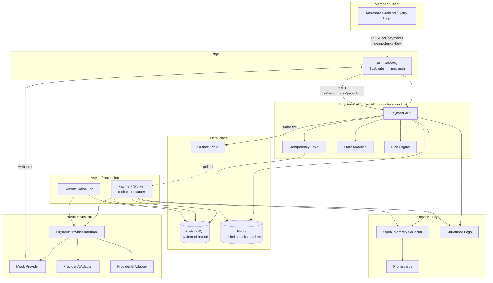
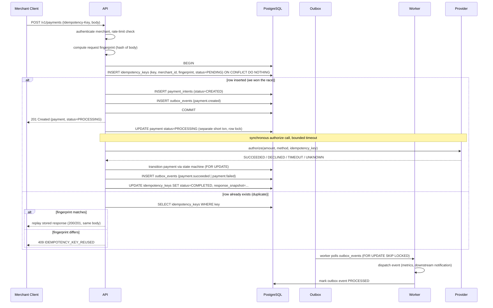
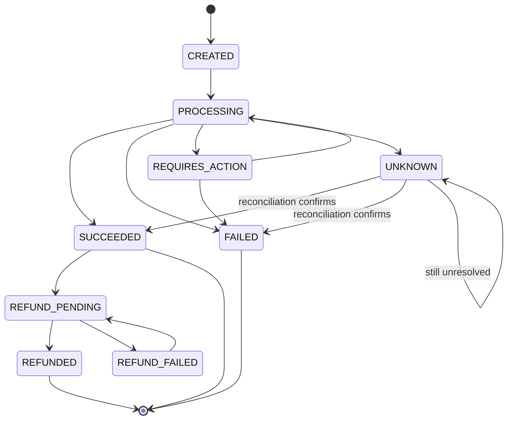
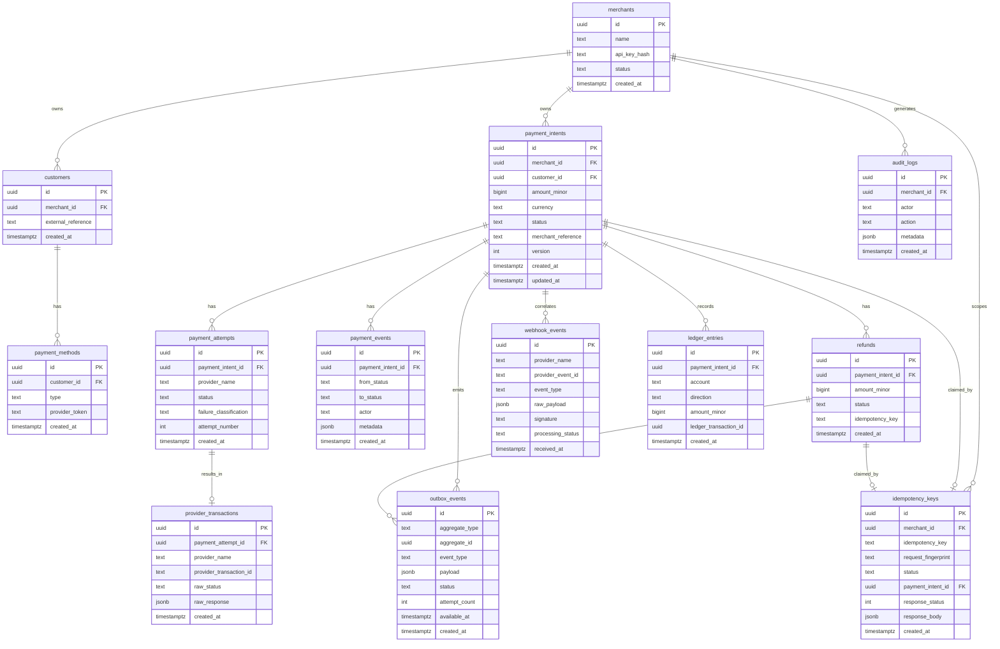
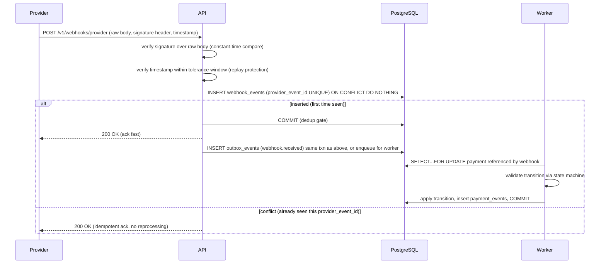
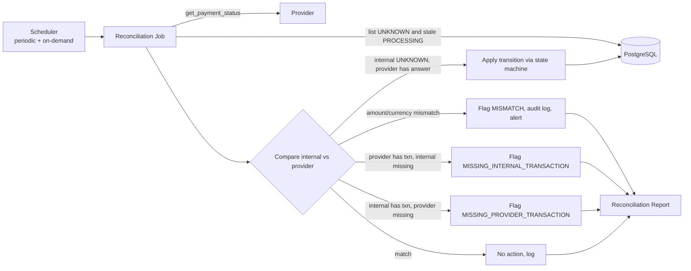

# PayGuard — Architecture (Phase 1)

Status: design baseline. No implementation code exists yet — this document is the
contract that Phase 2 onward will be built against. Where a later phase changes a
decision made here, the change will be recorded as a new ADR rather than a silent
edit to this file.

---

## 1. Executive Architecture Overview

PayGuard is a **modular monolith + workers**, not a microservices mesh. There is one
deployable API process, one deployable worker process, and one mock-provider process,
all sharing a single PostgreSQL database and a single Redis instance. Internally the
codebase is split into cleanly-bounded packages (`domain`, `idempotency`, `payments`,
`providers`, `ledger`, `reconciliation`, `risk`, `observability`) so the boundaries that
would matter if this were ever split into services already exist in the code — just not
across a network.

Why not microservices: the core problem here is **transactional correctness**
(idempotency, locking, outbox, ledger invariants), and every one of those techniques is
easiest to get right — and easiest to *prove* correct in tests — when the payment write
path lives inside a single database transaction. Splitting `payment_intents` and
`idempotency_keys` across two services would force distributed transactions or sagas to
solve a problem a single `BEGIN...COMMIT` already solves for free. Services get split
later only when a component has a genuinely different scaling or failure profile — the
worker is already a separate process for exactly that reason: it must keep running
(retrying outbox events, polling providers) independent of API request/response cycles.

**What guarantees the core promise (no duplicate payments)?**
1. A database-level unique constraint on `(merchant_id, idempotency_key)` — not an
   application-level check-then-act.
2. All idempotency-key claim + payment-row creation happens inside one serializable
   database transaction, so concurrent requests race on a constraint the database
   enforces atomically, not on apppthe recautionary code.
3. Every state transition is validated against an explicit state machine before being
   written, inside a transaction that holds a row lock (`SELECT ... FOR UPDATE`) on the
   payment being mutated.
4. Every write that must eventually cause an external effect (calling a provider,
   emitting a webhook-triggered notification) is recorded transactionally via the
   outbox pattern, so "DB committed but event lost" cannot happen.

## 2. Architecture Diagram



Deployables: `api` (stateless, horizontally scaled), `worker` (outbox consumer +
reconciliation scheduler, horizontally scaled with per-event locking), `mock-provider`
(standalone HTTP service simulating a real PSP, including its own async webhook
delivery), `postgres`, `redis`. Prometheus/Grafana are operational sidecars, not part of
the payment write path.

## 3. Request Lifecycle

Happy path for `POST /v1/payments`:



Two things are deliberately separate: (1) the transaction that **claims** the
idempotency key and creates the `CREATED` payment row, and (2) the **provider call**,
which is a slow, unreliable network operation that must never happen inside an open
database transaction (holding a row lock or a long-lived transaction across a network
call to a third party is a reliability and deadlock hazard). The provider call happens
after the first transaction commits, under an explicit row lock re-acquired just for the
transition write.

## 4. Idempotency Design

### 4.1 What "idempotent" means here

Two requests with the same `Idempotency-Key` and the same logical request body must
produce exactly one payment operation and both callers must observe the same result.
Two requests with the same key and a *different* body are a client bug and must be
rejected loudly (`409 IDEMPOTENCY_KEY_REUSED`), never silently merged or silently
overwritten.

### 4.2 Storage model

```
idempotency_keys
  id                  uuid PK
  merchant_id         uuid FK -> merchants
  idempotency_key     text            -- as sent by client
  request_fingerprint text            -- sha256(canonical JSON of method+path+body)
  status              enum(PENDING, COMPLETED, FAILED)
  payment_intent_id   uuid FK -> payment_intents NULL
  response_status     int NULL
  response_body       jsonb NULL
  created_at          timestamptz
  updated_at          timestamptz
  locked_at           timestamptz NULL   -- diagnostic: how long a PENDING row has been in flight

  UNIQUE (merchant_id, idempotency_key)
```

The unique constraint is the actual safety mechanism, not a convenience index. Key
scoping is per-merchant, not global — merchant A and merchant B may reuse the same key
string with zero interaction, which also gives us tenant isolation for free at this
layer.

### 4.3 Why not `if key_exists(): ...`

A read-then-write check is a classic TOCTOU race: two requests can both read "key does
not exist" before either has written, and both proceed to create a payment. This is not
a theoretical race — under real retry storms (client library retries + load balancer
retries + mobile network flakiness) simultaneous duplicate submissions are the *expected*
case, not an edge case.

### 4.4 Claim protocol

```sql
INSERT INTO idempotency_keys (merchant_id, idempotency_key, request_fingerprint, status)
VALUES ($1, $2, $3, 'PENDING')
ON CONFLICT (merchant_id, idempotency_key) DO NOTHING
RETURNING id;
```

- If a row is returned: this request won the race. It proceeds to create the payment
  in the same transaction and later fills in `response_status`/`response_body` on
  completion.
- If no row is returned: a concurrent or prior request already claimed this key. The
  app then `SELECT`s the existing row:
  - `request_fingerprint` mismatch → `409 IDEMPOTENCY_KEY_REUSED` immediately, no
    database mutation.
  - `status = COMPLETED` → replay `response_status`/`response_body` verbatim.
  - `status = PENDING` → another request (or the same client's earlier attempt) is
    still in flight. The API returns `409 REQUEST_IN_PROGRESS` (or, for a short bounded
    window, polls with backoff) rather than inventing a second concurrent execution of
    the same logical operation. It never blocks indefinitely.
  - `status = FAILED` (the in-flight attempt crashed before completing, e.g. process
    killed mid-request) → this is what reconciliation and a bounded staleness check on
    `locked_at` are for: past a timeout, a `PENDING` row with no forward progress is
    treated as `FAILED` and safe to retry through, because the state machine (not the
    idempotency row) is the final authority on whether a provider charge happened.

### 4.5 Response replay

`response_status` and `response_body` are the literal HTTP response bytes returned to
the winning request, stored once `status` flips to `COMPLETED`. Replays return exactly
that payload — they do not re-derive a response from current payment state, because
current state may have moved on (e.g. a payment that has since been refunded should
still show the original `201 Created` payload to a very-late duplicate creation
request; the current state is available from `GET /v1/payments/{id}`).

## 5. Concurrency / Race-Condition Strategy

Three distinct race conditions are in scope, each with a distinct mechanism:

| Race | Mechanism | Owner of the guarantee |
|---|---|---|
| Duplicate payment creation (same idempotency key, concurrent) | `UNIQUE (merchant_id, idempotency_key)` + `INSERT ... ON CONFLICT DO NOTHING` | PostgreSQL constraint |
| Concurrent state transitions on one payment (e.g. worker retry vs. webhook arriving simultaneously) | `SELECT ... FOR UPDATE` on `payment_intents.id` before validating/applying a transition | Row lock, held for the duration of one short transaction |
| Concurrent refunds against one payment exceeding its balance | `SELECT ... FOR UPDATE` on the payment row (refunds are children, but the invariant is on the parent's remaining balance) + `CHECK` constraint as a second line of defense | Row lock + database check constraint |

None of these use application-level mutexes or in-process locks — those don't work
across multiple API/worker replicas. Every lock that matters is a PostgreSQL row lock
scoped to one transaction on one connection; every uniqueness guarantee that matters is
a database constraint. Redis is used for things where *approximate* coordination is
acceptable (rate limiting, circuit-breaker state) — never for the correctness-critical
path.

**Why `SELECT ... FOR UPDATE` and not optimistic concurrency (version column +
compare-and-swap)?** Both are valid; `FOR UPDATE` was chosen because payment state
transitions are short (single row, few milliseconds of DB-side work once the slow
provider call is excluded from the transaction) and because we want losers to *block and
then see the winner's committed state*, not retry blindly. Optimistic CAS would require
every caller to implement a retry loop for a normal, expected occurrence (worker and API
racing), which is more failure-prone than a bounded lock wait. This tradeoff is written
up in [ADR-002](adr/ADR-002-postgresql-locking-strategy.md).

## 6. Payment State Machine



Transitions are enforced by an explicit allow-list (`packages/payments/state_machine.py`
in Phase 2), not by convention:

| From | To | Allowed trigger |
|---|---|---|
| CREATED | PROCESSING | API begins provider authorization |
| PROCESSING | SUCCEEDED | Provider authorize/capture success, or reconciliation |
| PROCESSING | FAILED | Provider decline, permanent error classification |
| PROCESSING | REQUIRES_ACTION | Provider requests 3DS / additional customer step |
| PROCESSING | UNKNOWN | Timeout/connection loss after request was transmitted |
| REQUIRES_ACTION | PROCESSING | Customer completes required action |
| REQUIRES_ACTION | FAILED | Action window expires / customer abandons |
| UNKNOWN | SUCCEEDED / FAILED | **Only** via reconciliation job confirming provider truth |
| UNKNOWN | UNKNOWN | Reconciliation attempted, provider still can't answer |
| SUCCEEDED | REFUND_PENDING | Refund request accepted |
| REFUND_PENDING | REFUNDED | Provider confirms refund |
| REFUND_PENDING | REFUND_FAILED | Provider declines/fails refund |
| REFUND_FAILED | REFUND_PENDING | Refund retried |

Explicitly forbidden, and rejected with `422 INVALID_STATE_TRANSITION` if attempted:
`FAILED → SUCCEEDED` via any path except reconciliation reversing an `UNKNOWN` (never
directly from a settled `FAILED`), `SUCCEEDED → CREATED`, `REFUNDED → *` (terminal),
skipping `PROCESSING` from `CREATED` straight to `SUCCEEDED` (there must always be an
attempt record), and any transition not in the table above. The validator function is
pure (`old_state, new_state, actor -> bool`) so it is trivially unit-testable and every
transition attempt — allowed or rejected — is written to `payment_events` as an
immutable audit trail.

## 7. Database ERD



Design notes: `payment_events`, `provider_transactions`, `webhook_events`, and
`ledger_entries` are append-only — rows are never updated or deleted, only inserted,
which is what makes them usable as an audit trail and what makes the ledger-balance
invariant checkable at any point in history. `payment_intents` carries an optimistic
`version` column in addition to being protected by row locks, used purely as a
belt-and-suspenders assertion in tests (`UPDATE ... WHERE id=$1 AND version=$2` should
never affect zero rows inside code that already holds the lock — if it does, that is a
bug, and tests assert this).

## 8. Transaction Boundaries

Explicit rule: **a database transaction must never span a network call to an external
system** (payment provider, webhook delivery, message broker). This is the single most
important transaction-boundary rule in the codebase, because holding a Postgres row
lock while waiting on a slow or hanging third party is how a provider outage turns into
a database outage.

| Operation | Transaction 1 (DB-only) | External call (no open txn) | Transaction 2 (DB-only) |
|---|---|---|---|
| Create payment | Claim idempotency key + insert `payment_intents(CREATED)` + insert outbox event, `COMMIT` | — | — |
| Authorize | — | `provider.authorize()` | `SELECT...FOR UPDATE` payment, validate transition, insert `payment_attempts`/`provider_transactions`/`payment_events`, insert outbox event, update idempotency response, `COMMIT` |
| Refund | `SELECT...FOR UPDATE` payment, check remaining balance, claim refund idempotency key, insert `refunds(REFUND_PENDING)`, insert outbox event, `COMMIT` | `provider.refund()` | `SELECT...FOR UPDATE` refund + payment, apply result, insert ledger entries, `COMMIT` |
| Webhook processing | `INSERT webhook_events ... ON CONFLICT (provider_name, provider_event_id) DO NOTHING`, `COMMIT` (dedup gate) | — | `SELECT...FOR UPDATE` payment, apply transition if webhook wins the race against the synchronous path, `COMMIT` |
| Outbox dispatch | `SELECT ... FOR UPDATE SKIP LOCKED` batch of pending events, `COMMIT` (claims them) | dispatch (metrics emit, notification) | mark `PROCESSED`/`FAILED` with backoff, `COMMIT` |

Isolation level: `READ COMMITTED` (Postgres default) for almost everything, because
every correctness-critical read is already protected by an explicit `FOR UPDATE` lock
or a unique constraint — we don't need `SERIALIZABLE`'s broader (and more
retry-prone) guarantees for reads that aren't locked. The one place `SERIALIZABLE` is
considered is the ledger-balance invariant check during reconciliation reporting (a
read-only consistency snapshot across many rows), documented in
[ADR-007](adr/ADR-007-ledger-design.md).

## 9. Provider Abstraction

```python
class PaymentProvider(Protocol):
    async def authorize(self, request: AuthorizeRequest) -> ProviderResult: ...
    async def capture(self, provider_transaction_id: str, amount_minor: int) -> ProviderResult: ...
    async def refund(self, provider_transaction_id: str, amount_minor: int, idempotency_key: str) -> ProviderResult: ...
    async def get_payment_status(self, provider_transaction_id: str) -> ProviderResult: ...
```

`ProviderResult` is a closed set: `SUCCEEDED | DECLINED | TEMPORARY_FAILURE | UNKNOWN`
plus a `provider_transaction_id` and raw payload for audit storage. Every provider
adapter (`MockProvider`, and later `ProviderA`/`ProviderB` adapters) must map its
provider-specific responses onto this closed set — the rest of the system never branches
on a provider-specific status string. `get_payment_status` is what reconciliation calls
when the synchronous path returns `UNKNOWN`; it is required, not optional, precisely
because "ask the provider what actually happened" is the answer to the hardest problem
in this project (§10 in the original brief).

`MockProvider` accepts a per-request scenario hint (or merchant/global chaos
configuration) to deterministically return `SUCCESS`, `DECLINED`, `TIMEOUT`,
`TEMPORARY_FAILURE`, `DUPLICATE_RESPONSE`, `UNKNOWN_RESULT`, or `SLOW_RESPONSE`, and
emits webhooks asynchronously the same way a real PSP would, including the ability to
send duplicate/out-of-order webhooks on demand — this is what makes the concurrency and
chaos tests (§4, §25 of the brief) reproducible instead of flaky.

## 10. Transactional Outbox Design

Problem: after a payment transaction commits, the system needs to *reliably* trigger
side effects (metrics, downstream notifications, eventually message-bus events) without
risking the classic failure — "DB committed, but the publish step crashed/failed and the
event is lost forever," which silently desyncs internal state from anything downstream.

Solution: the outbox row is written in the **same transaction** as the payment mutation
it describes (see §8's transaction table). If the transaction commits, the event is
durably persisted — there is no window where the payment exists but the event doesn't.
A separate worker polls `outbox_events` for `status = PENDING AND available_at <= now()`
using `SELECT ... FOR UPDATE SKIP LOCKED`, which lets multiple worker replicas pull
different rows concurrently without blocking each other or double-processing a row.

Outbox event lifecycle: `PENDING → PROCESSING → PROCESSED`, or on failure
`PENDING → PROCESSING → PENDING` (with `attempt_count += 1`,
`available_at = now() + backoff(attempt_count)`, `failure_reason` recorded) until
`attempt_count` exceeds a max, at which point the row moves to `DEAD_LETTER` and is
excluded from normal polling but remains queryable for operator inspection/replay. This
gives us retries, exponential backoff, and dead-letter handling without a separate
message broker — Postgres itself is the queue, which is an appropriate choice at this
project's scale and keeps the "one primary datastore" property that makes the
correctness story simple to reason about and test.

## 11. Webhook Architecture



Signature verification happens on the **raw request body bytes** before any JSON
parsing, because parsing then re-serializing to verify can change byte-for-byte content
(key order, whitespace, number formatting) and silently break signature verification —
or worse, silently accept a tampered payload if verification is done against the
re-serialized form instead of what was actually sent. Deduplication key is
`(provider_name, provider_event_id)`, enforced by a unique constraint exactly like the
idempotency-key design in §4 — same pattern, same reasoning, applied to inbound events
instead of inbound requests. Heavy processing (applying the state transition) is done
asynchronously by the worker after a fast `200 OK` ack, both so slow processing doesn't
cause the provider to time out and retry (creating more duplicates) and so a lock
contested with the synchronous API path doesn't block the HTTP response.

## 12. Reconciliation Architecture



Reconciliation exists because the honest answer to "the provider request timed out
after the network sent it" is **we do not know what happened**, and the only safe move
is to ask the provider's system of record, not to guess by retrying (§13) or by assuming
success or failure. It runs on a schedule against every payment in `UNKNOWN` state and
every payment stuck in `PROCESSING` past an expected SLA window, and can also be
triggered on-demand (dashboard button, demo scenario). Every reconciliation pass writes
an immutable report row (`MATCHED | MISMATCH | MISSING_PROVIDER_TRANSACTION |
MISSING_INTERNAL_TRANSACTION | AMOUNT_MISMATCH | CURRENCY_MISMATCH | UNKNOWN`) — the
report itself becomes part of the audit trail, not just a transient log line.

## 13. Security Model

- **AuthN**: merchants authenticate with an API key (`pk_live_...`/`pk_test_...` style
  prefix + secret). Only a salted hash of the secret is stored; the plaintext is shown
  once at creation. Key rotation is modeled as issuing a new key with an overlap window
  before revoking the old one, not in-place mutation of a key's secret.
- **AuthZ / tenant isolation**: every payment-scoped row carries `merchant_id`, and every
  query path is required to filter by the authenticated merchant's id — enforced at the
  repository layer, not left to individual endpoint handlers, and explicitly tested by
  attempting cross-merchant reads (§18 of the brief).
- **Webhook trust boundary**: the webhook endpoint trusts nothing about the caller
  except a valid HMAC signature computed with a per-provider shared secret over the raw
  body + timestamp; everything else (IP, headers) is informational only.
- **Rate limiting**: merchant-scoped token buckets held in Redis so limits are shared
  correctly across horizontally-scaled API replicas (see [ADR](adr/) discussion in
  Phase 16 security doc).
- **Secrets**: provider API keys, webhook secrets, and DB credentials are read from
  environment/secret store, never committed, never logged; structured logging includes
  an explicit redaction step for known-sensitive fields (tokens, secrets, full payment
  method identifiers).
- **No real card data, ever**: payment methods are opaque tokens (`pm_demo_...`) handed
  to the mock provider. This is a hard boundary, not a TODO — PayGuard is not, and will
  never become, a system that touches PANs, CVVs, or bank credentials, mock or real.

Full threat model lands with Phase 16 as `docs/security.md`; this section is the design
baseline it will be checked against.

## 14. Observability Architecture

Every payment operation carries three correlation identifiers end-to-end: `request_id`
(one per inbound HTTP request), `payment_id` (stable for the life of the payment,
propagated into the async worker/reconciliation paths via the outbox payload), and
`provider_transaction_id` (once assigned). These are attached to structured log lines,
OpenTelemetry span attributes, and Prometheus exemplar labels, so a single payment can
be traced from the inbound API call through the worker through the provider call through
the webhook that eventually confirms it.

Metrics (Prometheus) are counters/histograms owned by the layer that observes the
event directly — the API owns `payment_requests_total`/`idempotency_conflicts_total`,
the provider adapter owns `provider_latency`/`provider_timeout_total`, the outbox
worker owns `outbox_backlog`, reconciliation owns `reconciliation_mismatches`. Full list
in §23 of the product brief; Phase 12 is where these are wired up and
`docs/observability.md` is written against real dashboards, not a plan.

## 15. Repository Structure

```
payguard/
├── apps/
│   ├── api/                 # FastAPI app: routing, request/response models, auth
│   ├── worker/               # outbox consumer, reconciliation scheduler
│   └── mock-provider/        # standalone deterministic PSP simulator + webhook sender
├── packages/
│   ├── domain/                # core entities, value objects, state machine
│   ├── database/              # SQLAlchemy models, Alembic migrations, session mgmt
│   ├── payments/               # payment/refund use-case logic
│   ├── idempotency/            # idempotency key claim/replay logic
│   ├── providers/               # PaymentProvider protocol + adapters
│   ├── risk/                    # rule-based risk engine
│   ├── ledger/                   # double-entry ledger writer + invariants
│   ├── reconciliation/            # reconciliation engine
│   └── observability/              # logging, tracing, metrics setup shared by apps
├── frontend/                        # React + TS + Tailwind dashboard
├── tests/
│   ├── unit/  integration/  concurrency/  e2e/  property/
├── infra/
│   ├── docker/  kubernetes/  terraform/
├── docs/
│   ├── adr/  architecture.md  (+ per-topic docs added per phase)
├── scripts/                          # load test runners, metric report generators
├── docker-compose.yml
├── Makefile
├── pyproject.toml
└── README.md
```

`packages/` has no dependency on `apps/` in either direction that would create a cycle:
`apps/api` and `apps/worker` both depend on `packages/*`, never the reverse, which is
what keeps the worker able to reuse the exact same payment/idempotency/state-machine
logic the API uses instead of re-implementing it.

## 16. Technology Choices

| Choice | Why |
|---|---|
| **Python 3.12 + FastAPI** | async-native, strong typing story with Pydantic, fast enough that the interesting bottlenecks in this project are DB/lock contention, not framework overhead — which is the point. |
| **PostgreSQL** | the entire correctness story (unique constraints, `FOR UPDATE`, `SKIP LOCKED`, `CHECK` constraints, transactions) depends on a real relational database with strong isolation guarantees. No NoSQL option gives this for free. |
| **SQLAlchemy 2.x (async) + Alembic** | explicit, reviewable SQL-adjacent ORM usage with real migration history — avoids hiding lock/transaction behavior behind magic. |
| **Redis** | used only where approximate/ephemeral coordination is correct: rate limiting, circuit-breaker state, non-critical caching. Never the source of truth for money. |
| **Outbox on Postgres, not Kafka/RabbitMQ** | at this project's scale, a broker would add operational surface area without adding a correctness property Postgres doesn't already give us via `SKIP LOCKED`. Documented as a deliberate scale tradeoff in [ADR-003](adr/ADR-003-transactional-outbox.md). |
| **OpenTelemetry + Prometheus + Grafana** | industry-standard, vendor-neutral observability stack; exemplars tie metrics back to traces. |
| **React + TypeScript + Tailwind** | dashboard is a consumer of the API, not the product — kept simple and fast to build so engineering time stays on the backend. |
| **k6** | scriptable, code-as-config load testing that can express the idempotency-storm scenario precisely (shared key across virtual users), with good p50/p95/p99 + error-rate reporting. |
| **Docker Compose (local) / Kubernetes (prod-shaped) / Terraform (optional AWS)** | local dev must never require cloud credentials; the k8s/terraform layers exist to demonstrate production deployment thinking without making the everyday dev loop depend on them. |

## 17. Development Roadmap

See [`docs/roadmap.md`](roadmap.md) for the full phase list mirrored from the project
brief, with phase gates: each phase is expected to land with its own tests and, where
applicable, its own `docs/<topic>.md` describing what was actually built.

## 18. Top 10 Hardest Engineering Problems in This Project

1. **Guaranteeing exactly-one payment operation under concurrent identical requests**
   without relying on any lock that doesn't survive multiple API replicas — solved via
   a single database unique constraint as the only source of truth for "have we seen
   this key before," everything else (Redis, app memory) is explicitly untrusted for
   this decision.
2. **The unknown-outcome problem**: provider processed the payment but the response
   never arrived. The system must never guess, and must never blindly retry (a blind
   retry could double-charge if the first attempt actually succeeded). The only safe
   resolution is asking the provider's own system of record via reconciliation.
3. **Choosing transaction boundaries that exclude network calls** while still keeping
   the "commit implies event will eventually be delivered" guarantee — solved by
   separating the DB-only claim/record transactions from the provider call, glued
   together by the outbox pattern rather than one giant transaction.
4. **Preventing double refunds under concurrent partial-refund requests** whose sum
   must never exceed the original payment, enforced transactionally (row lock +
   check constraint), not just by summing existing refunds in application code before
   deciding.
5. **Webhook deduplication and ordering** when a provider may deliver the same event
   dozens of times, out of order, and concurrently with the synchronous API path
   racing to apply the same transition — both paths must converge on one final state
   without either overwriting a more-advanced state with a stale one.
6. **Designing a state machine that is provably impossible to move through invalid
   transitions**, including transitions that look superficially plausible (`FAILED` to
   `SUCCEEDED` via a late webhook) but must only ever happen through the reconciliation
   path, never directly.
7. **Avoiding deadlocks** when multiple entry points (API request, worker retry,
   webhook handler, reconciliation job) can all attempt to lock the same payment row —
   requires a consistent lock-ordering discipline and short critical sections, not
   just "add `FOR UPDATE` everywhere."
8. **Retry classification** — telling permanent failures, transient failures, and
   truly unknown outcomes apart reliably enough that the retry engine never turns a
   transient hiccup into a duplicate charge or a permanent failure into an
   infinite retry loop.
9. **Keeping the ledger's `sum(debits) == sum(credits)` invariant true under every
   partial-failure interleaving** — a crash between "provider confirmed refund" and
   "ledger entries written" must not silently produce an unbalanced ledger, which
   constrains where ledger writes are allowed to happen relative to state transitions.
10. **Proving all of the above under load**, not just in isolated unit tests — the
    100-concurrent-identical-request test and the concurrent-refund test have to
    demonstrate, against the real database and real lock behavior, that exactly one
    side effect occurred, not merely that all HTTP responses looked reasonable.
